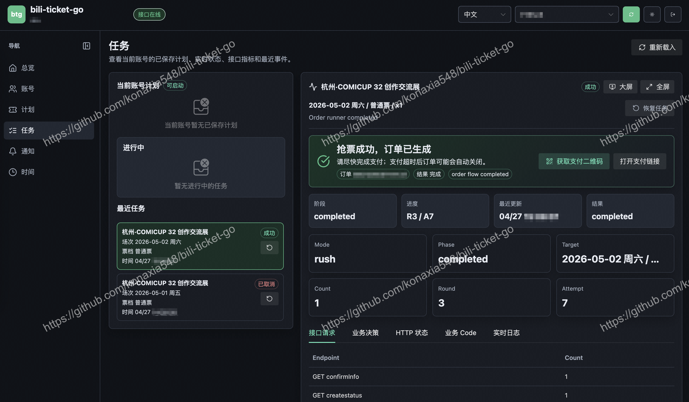

<div align="center">

# bili-ticket-go

BiliBili 会员购抢票 CLI/TUI 工具。

交流群：1087337195

</div>

## Web UI



## Release

| 设备 | 架构 | 压缩包                                                                     |
| --- | --- |-------------------------------------------------------------------------|
| Windows | `amd64` / `x86_64` | `bili-ticket-go-0.1.1-beta.1+20260428.action-windows-amd64-dynamic.zip` |
| macOS Intel | `amd64` / `x86_64` | `bili-ticket-go-0.1.1-beta.1+20260428.action-darwin-amd64-dynamic.zip`  |
| macOS Apple Silicon | `arm64` | `bili-ticket-go-0.1.1-beta.1+20260428.action-darwin-arm64-dynamic.zip`  |
| Linux x86_64 | `amd64` | `bili-ticket-go-0.1.1-beta.1+20260428.action-linux-amd64-static.zip`    |
| Linux ARM64 | `arm64` | `bili-ticket-go-0.1.1-beta.1+20260428.action-linux-arm64-static.zip`    |

## 战果

作者成功在星铁land 二开（hot project，需要ctoken/ptoken）2秒抢到票。


## 使用方式

压缩包内包含：

- 可执行文件
- 对应的 `.sha256` 校验文件

Windows:

```powershell
.\btg-windows-amd64-dynamic.exe
```

macOS / Linux:

```bash
chmod +x ./btg-darwin-arm64-dynamic
./btg-darwin-arm64-dynamic
```

## 功能说明

bili-ticket-go 是一个面向 Bilibili 会员购的交互式抢票工具。启动后会在终端里引导完成登录、项目识别、票种选择、购票人确认、下单执行、结果展示和推送通知。

### 登录和账号

- 短信登录：首次使用时输入手机号和短信验证码完成登录。
- 已保存账号：登录成功后账号会保存到本地，之后可直接选择继续使用。
- 账号失效处理：已保存账号不可用时，会提示重新登录。
- 登录验证码：发送短信或登录过程中需要验证码时，会优先尝试本地自动处理；无法自动完成时会回退到本地网页或终端手动输入。

### 项目识别

- 支持直接输入会员购项目 ID。
- 支持粘贴会员购项目详情链接。
- 支持粘贴手机会员购项目详情页右上角分享出来的链接。
- 支持 `b23.tv` 短链，程序会先展开短链，再识别对应项目。
- 无法识别项目时会提示错误并回到主菜单，不会继续进入下单流程。

### 票种识别

- 普通票：按项目原有场次、票档、销售日期和库存状态展示。
- 联票/场贩：检测到相关商品时，会在选择前主动询问是否购买，并只展示用户确认后的对应票种。
- 分享链接直达联票/场贩时，会优先按链接中的目标进入选择流程。
- 联票/场贩的实名规则可能无法完全提前判断，程序会要求用户手动确认实名类型，再继续选择购票人或联系人。
- 拼团票：检测到可用拼团时，会询问是否使用；部分拼团票数量固定为 1。

### 下单模式

#### 单次下单

适合当前已经开售、只想按所选票种尝试一次的场景。

流程特点：

- 选择一个销售日期、场次和票档。
- 填写或选择购票人、联系人、地址等必要信息。
- 下单前展示订单摘要，用户确认后执行。
- 如果检测到还未开售，会询问是否等待到开售时间再执行。

#### 抢票模式

适合明确目标场次和票档，希望持续尝试直到成功、失败或被取消的场景。

启动方式：

- 立即开始：确认后马上进入抢票循环。
- 定时开始：等待开售时间，到点后自动开始执行。

流程特点：

- 可选择暂不可售或未开售的目标票种。
- 会持续展示当前阶段、轮次、尝试次数和最近结果。
- 遇到库存瞬时不足、服务繁忙、风控验证等情况时，会按内置策略处理。
- 定时模式可配合时间校准，降低本机时间误差影响。

#### 蹲票模式

适合票档暂不可售、库存可能回流，或想同时监控多个候选票种的场景。

流程特点：

- 可一次选择多个候选票种。
- 用户可以设置候选优先级。
- 程序会持续监控可售状态。
- 命中可售候选后自动切入下单流程。
- 如果命中后库存又变为不可售，会回到监控状态继续等待。

### 购票人、联系人和配送

- 实名票会引导选择当前账号下的购票人。
- 非实名票会引导填写联系人姓名和手机号。
- 需要配送的项目会引导选择收货地址。
- 主菜单提供购票人管理，可查看当前账号购票人列表，也可新增购票人。
- 下单前会展示订单摘要，请确认项目、场次、票档、数量、购票人、地址和预计金额无误。

### 验证码和风控

- 抢票过程中如果需要图形验证，会优先尝试本地自动识别。
- 自动识别失败时，会打开本地网页完成验证。
- 本地网页不可用时，会回退到终端手动输入。
- 验证完成后会继续当前流程，不需要重新从主菜单开始。

### 支付和结果

- 下单成功后会展示订单号、支付链接和订单详情入口。
- 程序会生成支付二维码图片。
- 可选择在终端中直接显示支付二维码。
- 如果检测到已有待支付订单，会优先展示对应订单信息，避免重复下单。
- 执行失败时会返回主菜单，并保留日志用于排查。

### 推送通知

主菜单提供推送管理，可为当前账号配置通知渠道和事件开关。

支持的通知场景：

- 下单成功
- 已有待支付订单
- 下单失败
- 测试推送

支持的通知方式包括 Bark、Gotify、ntfy、PushPlus、Server 酱、桌面通知、声音提醒、钉钉、微信机器人、邮件、自定义命令等。不同渠道需要填写的信息不同，按界面提示配置即可。

### 时间校准

- 主菜单可手动发起时间校准。
- 定时抢票可在开始前自动校准当前会话时间。
- 时间校准只影响本次程序运行，不会修改系统时间。

## 使用说明

1. 解压对应平台的压缩包，进入解压后的目录。
2. 按上方命令启动可执行文件。
3. 首次启动选择“短信登录新账号”，输入手机号、短信验证码。
4. 登录成功后，在主菜单选择“开始抢票”。
5. 在“项目 ID 或详情链接”处输入项目 ID，或粘贴会员购详情页/分享链接。
6. 按提示选择下单模式、销售日期、普通票或联票/场贩、场次、票档和数量。
7. 按项目要求选择购票人、联系人或收货地址。
8. 检查终端展示的订单摘要，确认无误后选择开始执行。
9. 执行过程中可查看当前阶段、轮次、尝试次数和最近结果。
10. 下单成功后根据结果页中的支付链接或二维码完成支付。

模式选择建议：

- 已经开售且只想尝试一次，选择“单次下单”。
- 明确目标票种并希望持续尝试，选择“抢票模式 / 立即开始”。
- 明确开售时间，选择“抢票模式 / 定时开始”。
- 票档暂不可售、库存可能回流，或想同时盯多个票档，选择“蹲票模式”。
- 需要购买联票/场贩时，优先粘贴分享链接；如果项目同时包含普通票和联票/场贩，请按程序提示确认购买类型。

运行过程中可使用 `Esc` / `Ctrl+C` 取消当前选择或返回上级菜单。订单提交后请在支付有效期内完成付款，未付款订单可能会占用购票资格。

## 第三方组件许可

本项目发布版会内嵌 ONNX Runtime 原生运行库，用于本地验证码 ONNX 模型推理。macOS Intel 使用 ONNX Runtime `v1.23.2`，其它平台使用 ONNX Runtime `v1.25.0`。

ONNX Runtime: Copyright (c) Microsoft Corporation. Licensed under the MIT License.

项目地址：https://github.com/microsoft/onnxruntime
